# T02: DPR: còpies de seguretat. Cas pràctic
## PART 1: Windows 11 + Duplicati

Haurem de configurar una maquina virtual Windows afegint un disc dur (virtual) de 10 GB per a les còpies.

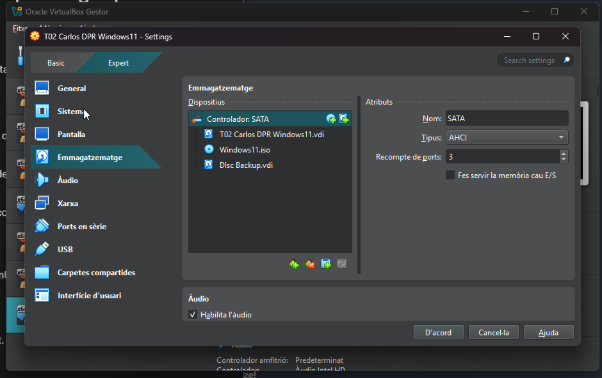

També crearem un nou compte de google drive per tenir espai d’emmagatzematge cloud.

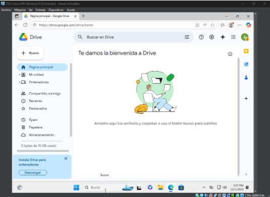

Seguidament accedim a la web
[duplicati.com/download](duplicati.com/download)
I descarguem duplicati per a Windows.

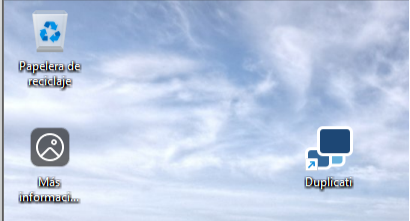

Un cop instal·lat l’obrim i sens obrira la web/app, en cas que no obri accedim des de l’url:
 
127.0.0.1:8200/ngclient/

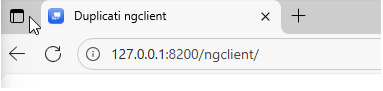

Un cop accedit per primer cop ens demanara introduïr una contrasenya, un cop desada ja estarem dins l’interfície.

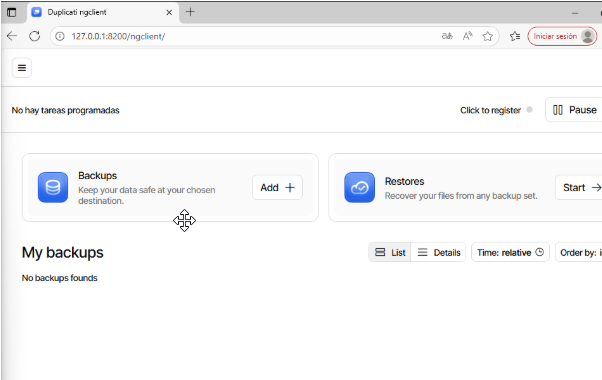

Ara crearem un nou backup des d’aquesta eina.

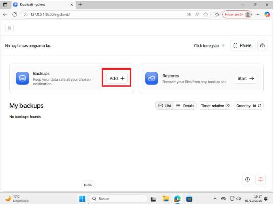

Seguirem els passos demanats i introduirem nom, descripció, xifratge, contrasenya…

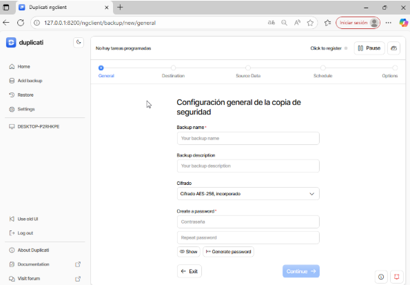

Seleccionem la destinació del nostre sistema (File System)

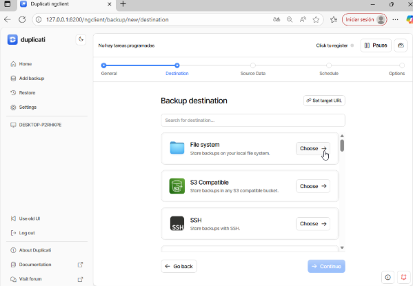

Seguidament haurem de seleccionar la ruta del nostre disc on guardarem les copies. En cas que no aparegui el nostre disc, haurem de inicialitzar el disc com vam aprendre al primer curs.

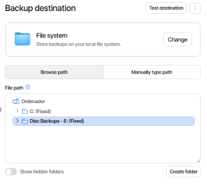

Haurem de seleccionar quines dades o d’on s’hauran de extreure les dades.

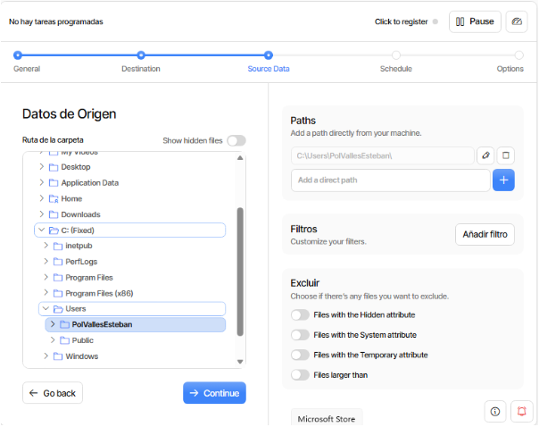

Farem click a seguent i escollirem quan s’executa la còpia.

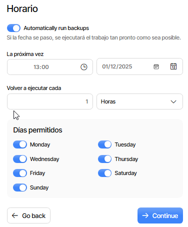

Seguidament haurem d’afegir l’opció passphrase per introduir una contrasenya. També haurem d’afegir l’opcio “snapshot-policy”

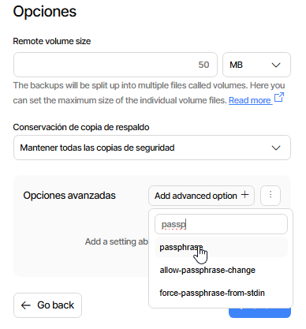 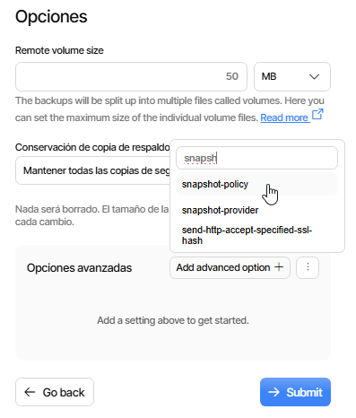

Ara podrem observar com ja tenim aquest backup creat correctament, l’executarem per provar el correcta funcionament.

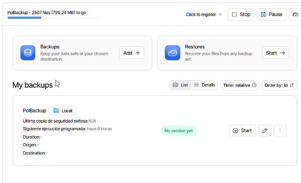

Un cop el procés ha finalitzat si obrim l’explorador d’arxius podem observar com s’han guardat les dades de forma xifrades.

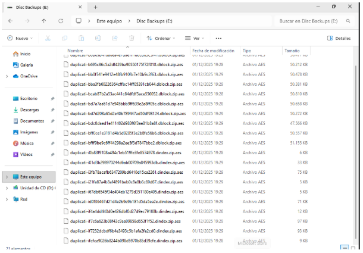

Ara veurem com fer backups a google drive.

Crearem un nou backup, però aquest cop seleccionarem el destí Google Drive.

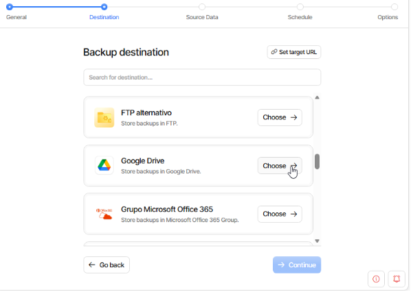

Un cop avancem, haurem de vincular duplicati amb google drive, per fer-ho farem clic sobre l’enllaç AuthID.

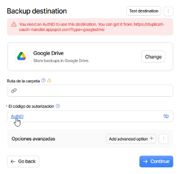

I iniciarem la sessió amb el nostre compte de Google (nou).

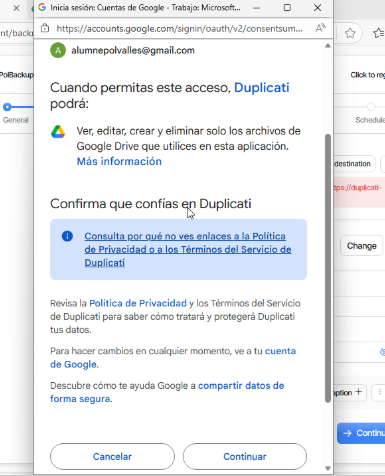

També haurem de indicar la ruta de la carpeta on volem guardar les dades, per fer-ho introduirem la url en el camp Ruta de la carpeta.

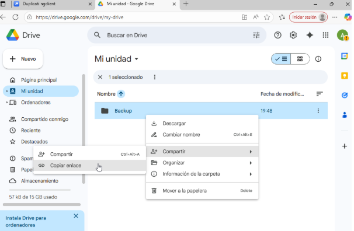 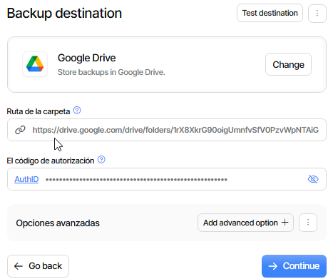

Seleccionem les mateixes dades d’origen.

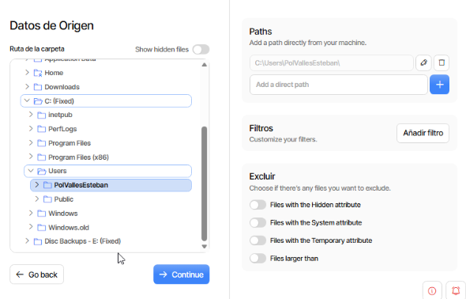

Definim quan s’executarà, diariament a les 18:00

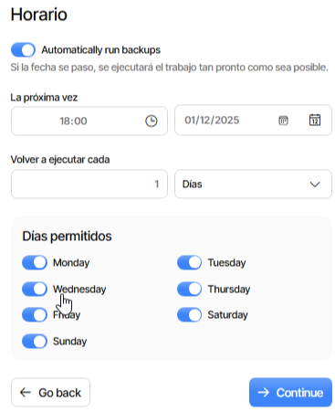

Afegirem l'opció passphrase com a l’anterior amb una contrasenya i snapshot-policy.

Executem el backup de Drive per realitzar un test.

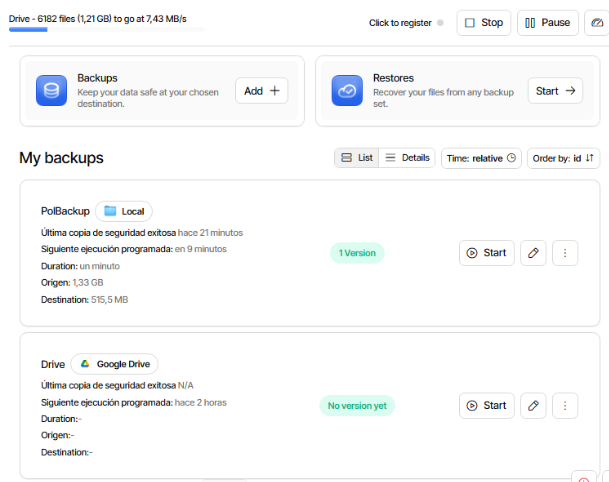

Al finalitzar podrem confirmar el correcta funcionament revisant la carpeta de google drive.

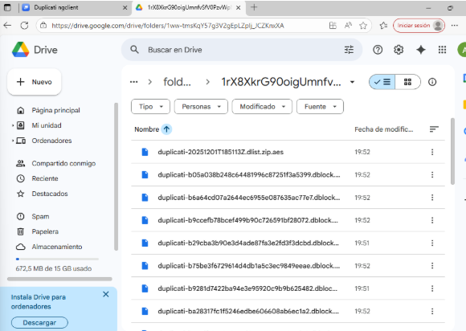

Ara farem algunes proves de les còpies i restauració, crearem un arxiu dins la ruta del usuari.

Crearem un arxiu dins el nostre directori personal amb la comanda:

```bash
fsutil file createnew C:\Users\[USUARI]\Documents\test1.txt 10485760
```

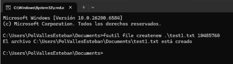

Seguidament farem una còpia des de duplicati, borrarem aquest arxiu i restaurarem desde l’eina.

 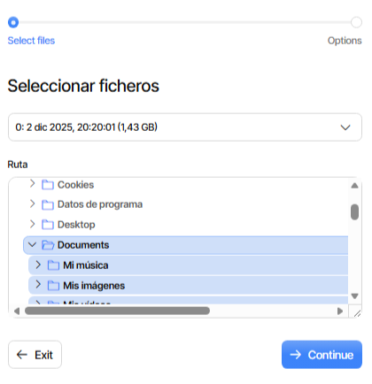  

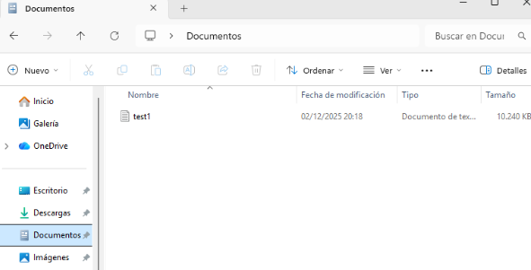

Si tot ha funcionat, podem observar com el document ha tornat al seu lloc. També podem revisar de la mateixa forma el funcionament del backup amb Google Drive. Aquest s'ha de crear de la mateixa manera que l'anterior però seleccionant el mètode Google Drive.

Executem una còpia a google drive, eliminem el fitxer manualment, i restaurem.

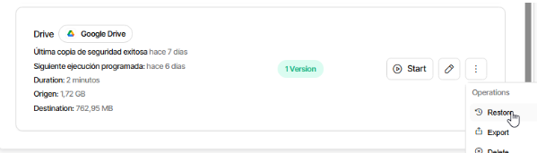 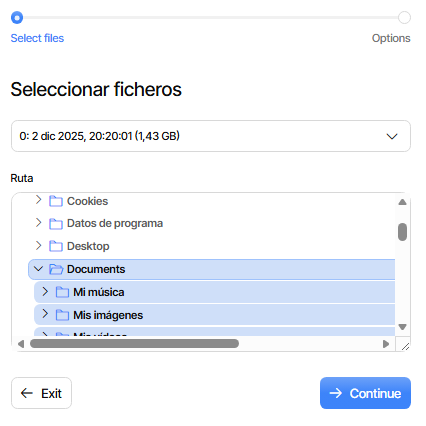

Seleccionem la carpeta Documents i continuem.

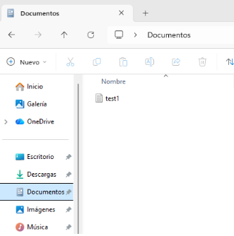

Si tot ha funcionat, podem observar com el document ha tornat al seu lloc.

## Part 2: Còpia seguretat servidor Linux

De la mateixa manera que la VM de Windows haurem de tenir dos disc durs, el per defecte i un segon on guardarem les còpies. 

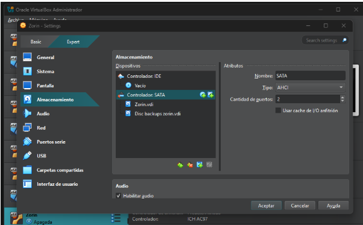

Un cop dins la màquina verifiquem que estigui detectant aquest.
```bash
lsblk
```

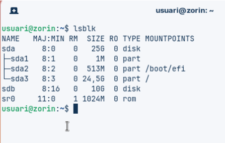

Creem una partició sobre el nou disc amb la comanda:
```bash
sudo fdisk /dev/sdb
```

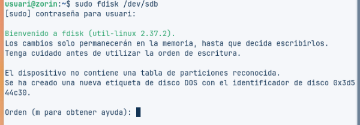

Un cop ens aparegui el “menu” indicarem les instruccions:
n → Per crear una nova partició
p → indiquem que es primària
Enter
Enter
Enter
W → Guardar i sortir

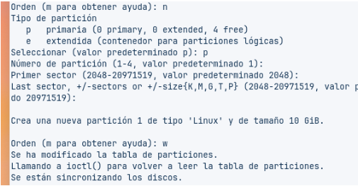 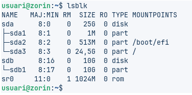

Formategem el disc en format XFS, pero primer de tot haurem d’instal·lar el servei XFS 
```bash
sudo apt install xfsprogs
```
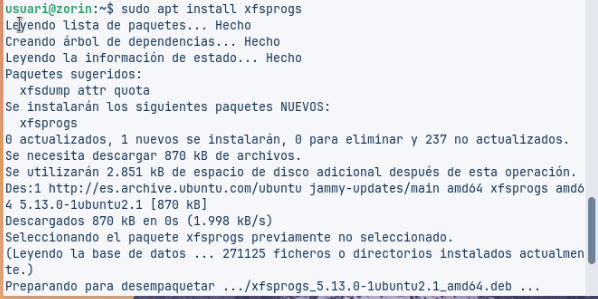

```bash
sudo mkfs.xfs /dev/sdb1
```
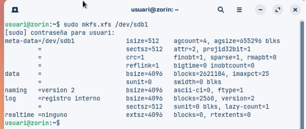

Seguidament crearem una carpeta i muntarem el disc a aquesta.
```bash
sudo mkdir -p /media/backup
sudo mount /dev/sdb1 /media/backup
```
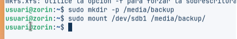

Podem comprovar si està muntat correctament amb la comanda.
```bash
df -h | grep backup
```
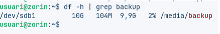

Ara instal·larem duplicity, l’eina per automatitzar les còpies.
```bash
sudo apt install duplicity -y
duplicity –version
```
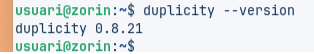

Crearem dos usuaris, asegurant-nos que tenen directoris personals.
```bash
sudo adduser usuari1
sudo adduser usuari2
```
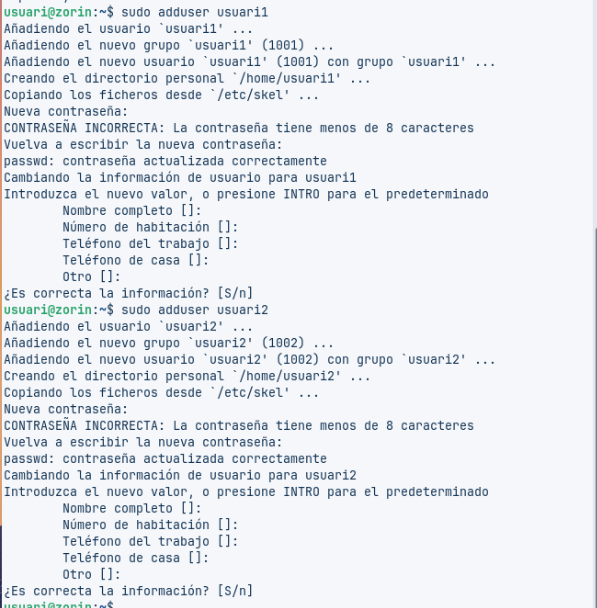

Ara crearem 4 fitxers de 10 MB dins el directori que hem creat anteriorment.
for i in 1 2 3 4; do sudo dd if=/dev/zero of=fitxer$i bs=1M count=10; done

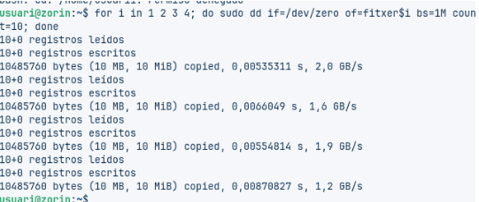

Comprovem amb `ls -lh`

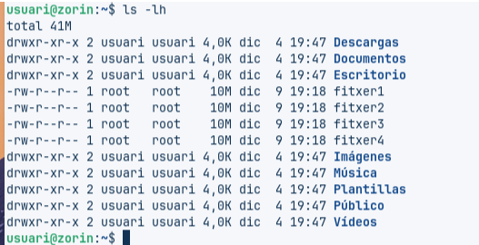

Crearem la copia amb duplicity, ens demana un passphrase (contrasenya) la qual la xifrarà.
```bash
sudo duplicity /home file:///media/backup/home-backup
```

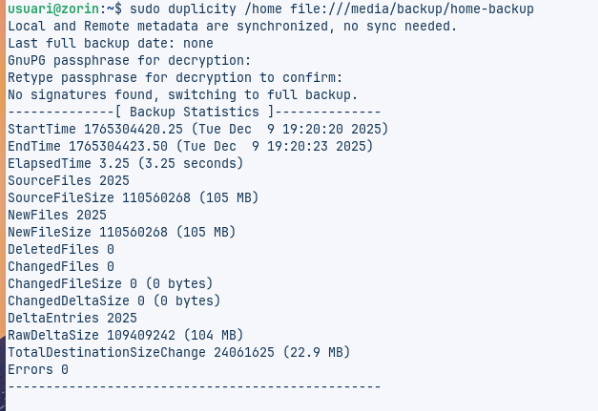

Al finalitzar, podem observar que hi ha al directori destí.

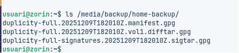

Seguidament esborrarem els arxius de prova creats anteriorment per veure si els pot restaurar correctament.
```bash
sudo rm fitxer1 fitxer2 fitxer3 fitxer4
ls
```

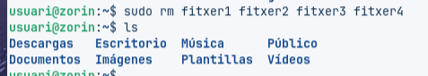

Ara restaurarem els arxius amb duplicity
```bash
sudo duplicity restore file:///media/backup/home-backup /home/restored
ls /home/restored/usuari
```

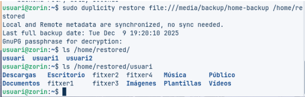

Com podem observar ens ha restaurat els fitxers.

Ara afegirem un fitxer nou i veurem com la nova còpia és incremental.​
```bash
sudo dd if=/dev/zero of=fitxer_nou bs=1M count=4
ls -lh
```

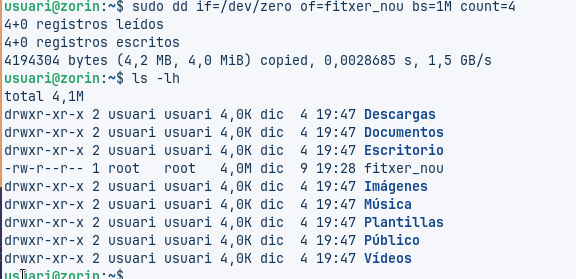

Executarem la mateixa comanda d’abans per crear la còpia.
```bash
sudo duplicity /home file:///media/backup/home-backup
```

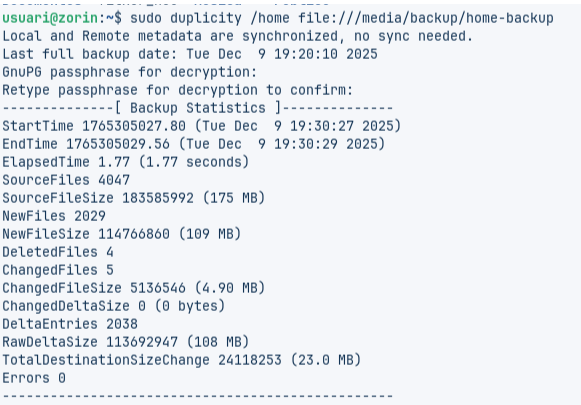

Podem veure l’informació del backup
```bash
sudo duplicity collection-status file:///media/backup/home-backup
```

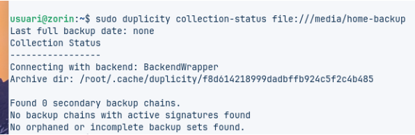

Ara desmontem l’unitat
```bash
sudo umount /media/backup
```
I comprovem 
```bash
df -h | grep backup
```


Ara automatitzarem tots aquest procesos amb un script.
```bash
sudo nano /root/fullbackup.sh
```

```bash
#!/bin/bash

mount /dev/sdb1 /media/backup

export PASSPHRASE="la_teva_contrasenya"

duplicity full /home file:///media/backup/home-backup

unset PASSPHRASE

umount /media/backup
```


Ara donem permisos d’execució a aquest script.
```bash
sudo chmod +x /root/fullbackup.sh
```
I el provem manualment
```bash
sudo /root/fullbackup.sh
```


Si no dóna errors, està bé.​

Ara programarem l'execució amb cron.
```bash
sudo crontab -e
```
I afegim aquesta línea al final:
```bash
0 23 * * 0 /root/fullbackup.sh
```


Guardem els canvis amb 
```bash
sudo crontab -l
```


Ara crearem un altre script que farà el mateix però fent una còpia incremental
```bash
sudo nano /root/incrementalbackup.sh
```


Desem i sortim

Donem permisos d’execució a l’script
```bash
sudo chmod +x /root/incrementalbackup.sh
```
El provem manualment
```bash
sudo /root/incrementalbackup.sh
```


Ara afegim aquest script al cron també, tornem com a root a crontab
```bash
sudo crontab -e
```
A sota de la línia anterior, afegim:
```bash
0 23 * * 1-6 /root/incrementalbackup.sh
```


Desem els canvis
```bash
sudo crontab -l
```


