# T05: Accés Remot. Connexió via SSH (tasca individual)

Haurem de tenir dues VM, les dues amb interfícies Xarxa NAT i Host-Only. Per tant amb DHCP activat (true).

A continuació instal·larem **ssh**
```bash
sudo apt upgrade && sudo apt update && sudo apt install ssh -y
```
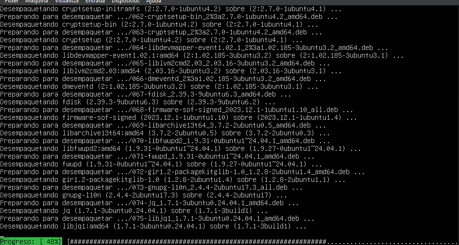
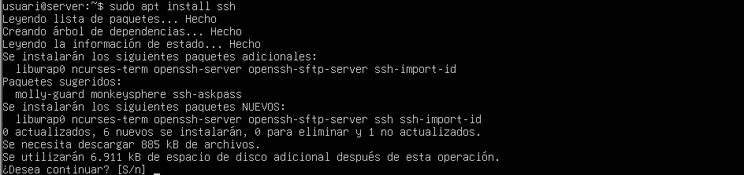

També habilitarem i iniciarem el servei ssh
```bash
sudo systemctl enable ssh
sudo systemctl start ssh
```
Per verificar
```bash
sudo systemctl status ssh
```

Un cop hem pogut observar quina es la IP del nostra servidor haurem d’instal·lar i configurar un client Windows, un cop estiguem dins haurem d’entrar a la terminal PowerShell, ara podrem conectarnos al servidor vía ssh.

```bash
ssh usuari@192.168.56.106
```
> ssh usuari@[IP del servidor del adaptador host-only]

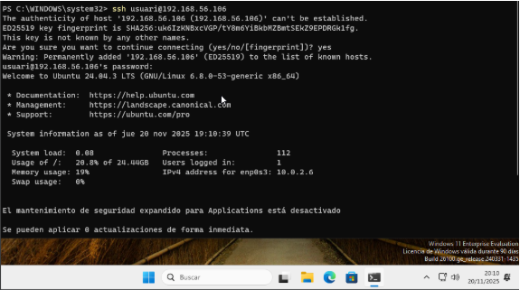

Ara podem verificar que estem treballant com si estiguessim des de ubuntu.
```bash
whoami
hostname
```
Si volem desactivar l’us de root en conexions ssh per garantir una major seguretat haurem d’editar l’arxiu /etc/ssh/sshd_config

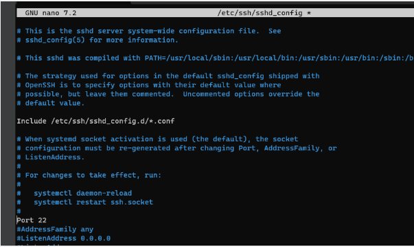

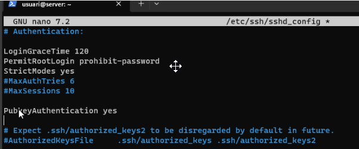


Fent això indiquem que el port de connexió es el 20 (Port 20) i no permitim connexions a root (PermitRootLogin prohibit-password).

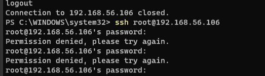

Ara podem fer una llista d’usuaris autoritzats a la connexió remota modificant l’arxiu anterior (sudo nano /etc/ssh/sshd_config) afegint la línea.

```bash
AllowUsers {usuaris separats per comes}
```

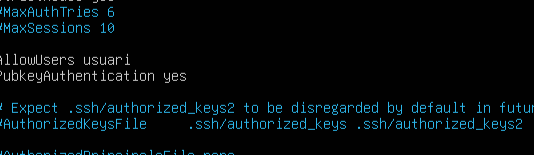

Per fer comprovació, crearem un nou usuari (usuari2) i provarem de conectarnos per ssh amb aquest.

```bash
sudo adduser usuari2
```
```bash
ssh usuari2@192.168.56.106
```

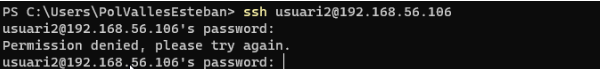

Com a resultat tindrem l’acces denegat!!

Ara tot el trànsit desde el client s’envia com si fos el servidor, pero si volem afegir una redirección dinàmica (dynamic forwarding) ens hem de conectar amb una variació a la comanda.

```bash
ssh -D 9876 usuari@192.168.56.106
```

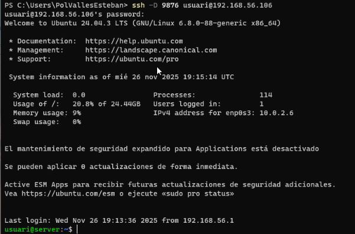

Ara configurarem el tunel de SOCKS.

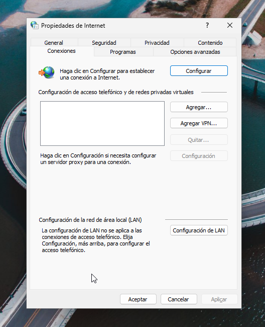

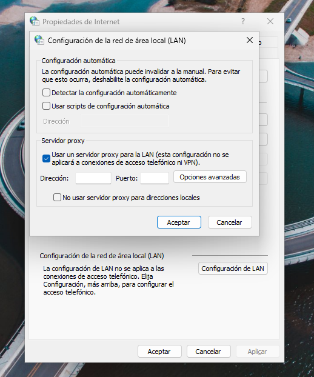

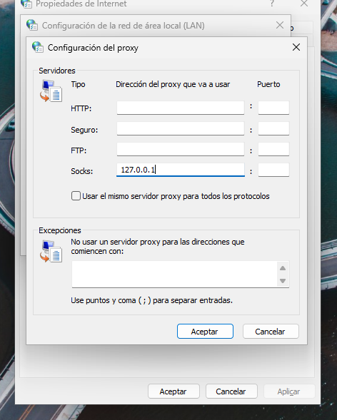

Amb wireshark podem comprovar que tot el trànsit que generem s’envia per SSH al servidor (Podem veure comunicacions entre 127.0.2.7 (IP CLIENT) y 192.168.56.106 (IP SERVIDOR)

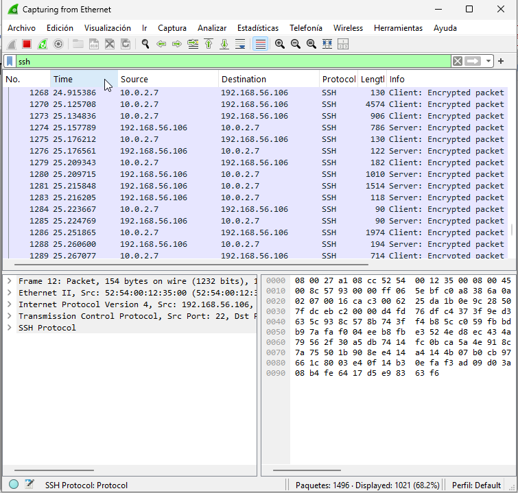

Ara veurem com connectar-nos al ssh sense haver de posar la contrasenya. Per fer-ho primer de tot haurem de generar una ssh public key amb les següents comandes.

Crear la key: 
```bash
ssh-keygen -t ed25519
```
Veure la key:
```bash
type $env:USERPROFILE\.ssh\id_ed25519.pub
```

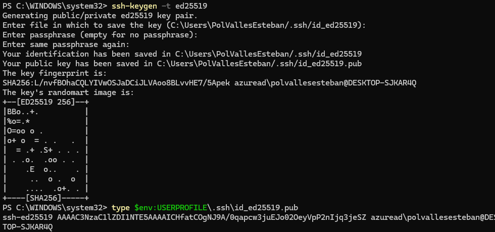

Ara des del servidor crearem un directori on només el propietari tingui permisos, on guardarem la key a authorized_keys.

Amb les comandes:

```bash
mkdir -p ~/.ssh
sudo chmod 700 ~/.ssh
sudo nano ~/.ssh/authorized_keys # Dins aquest arxiu enganxarem la key generada anteriorment.
cat ~/.ssh/auth	orized_keys # Per veure el contingut i verificar.
sudo chmod 600 ~/.ssh/authorized_keys # Ara el propietari només pot veure i escriure.
```

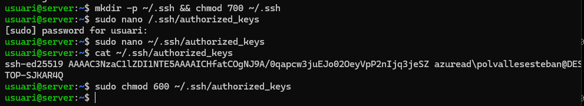

Ara ens podem connectar sense haver introduït manualment la contrasenya.

```bash
ssh -i $env:USERPROFILE\.ssh\id_ed25519 usuari@192.168.56.106
```
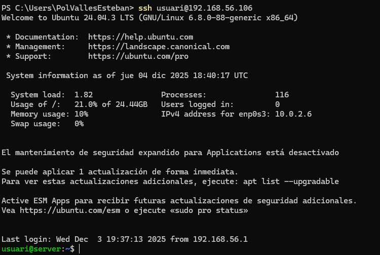
