# T06: Accés remot - Escriptori remot (RDP)

Per a fer aquesta pràctica haurem de tenir dues VM Windows i Zorin, les dues amb xarxa NAT per a que puguin veures entre elles dins la xarxa.

Farem comprovacions inicials amb ping entre elles, **abans haurem de desactivar el firewall de Windows, sino no funcionarà!!**

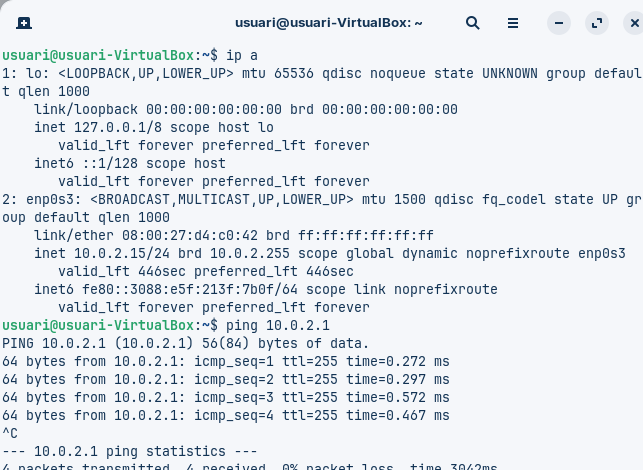

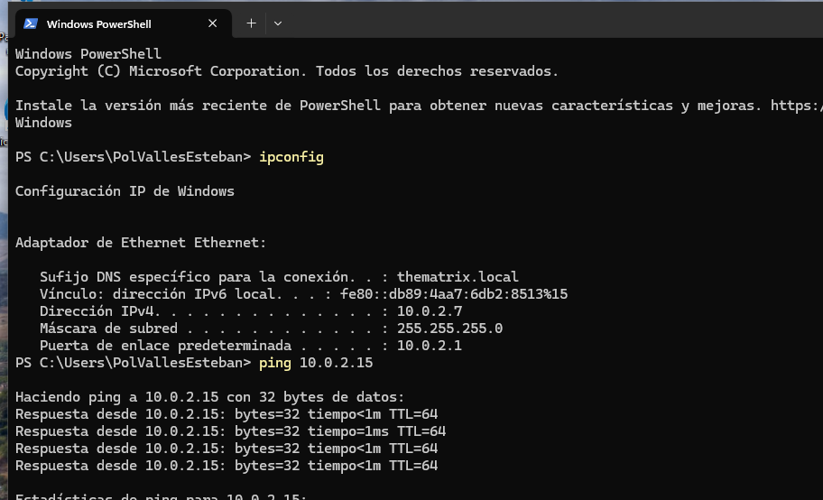

Com a primer pas haurem de tenir una màquina virtual amb Windows i activar l’escriptori remot en aquesta. Des de configuració → Sistema → Escritorio remoto

Es recomanable deixar activada la autentificació a nivell de xarxa.

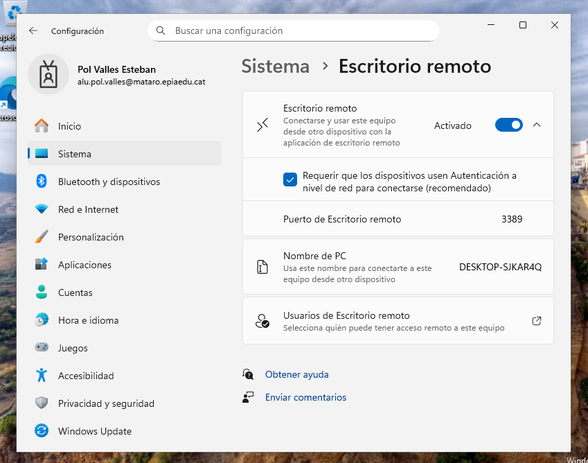

Ademés podrem afegir usuaris de escriptori remot.

**IMPORTANT: Haurem de crear un nou usuari per a poder conectarnos en cas de que no tinguem un, podem fer-ho des de Configuració-->Comptes-->Afegir un nou compte-->Sense un compte de microsoft i seguir les instruccions.**

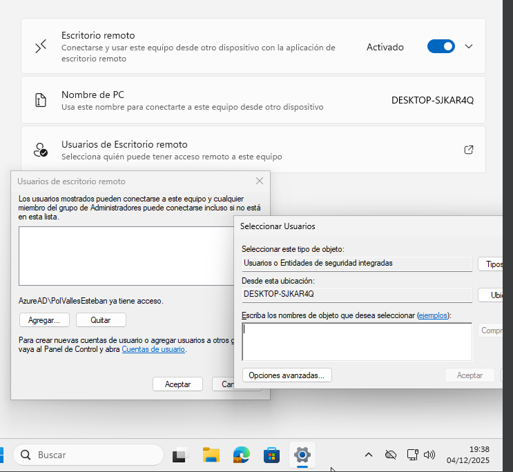

Ara haurem d’entrar a la segona VM, una màquina amb Zorin. Provarem de conectarnos al escriptori remot de Windows per fer-ho hem d’obrir Remmina.

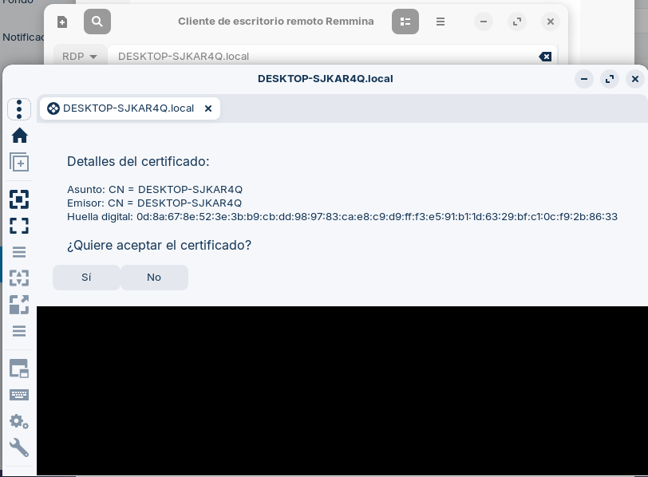

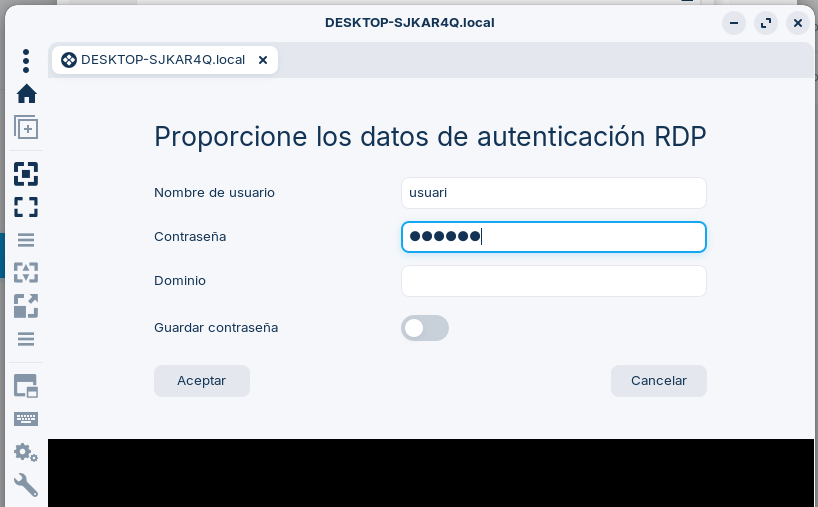

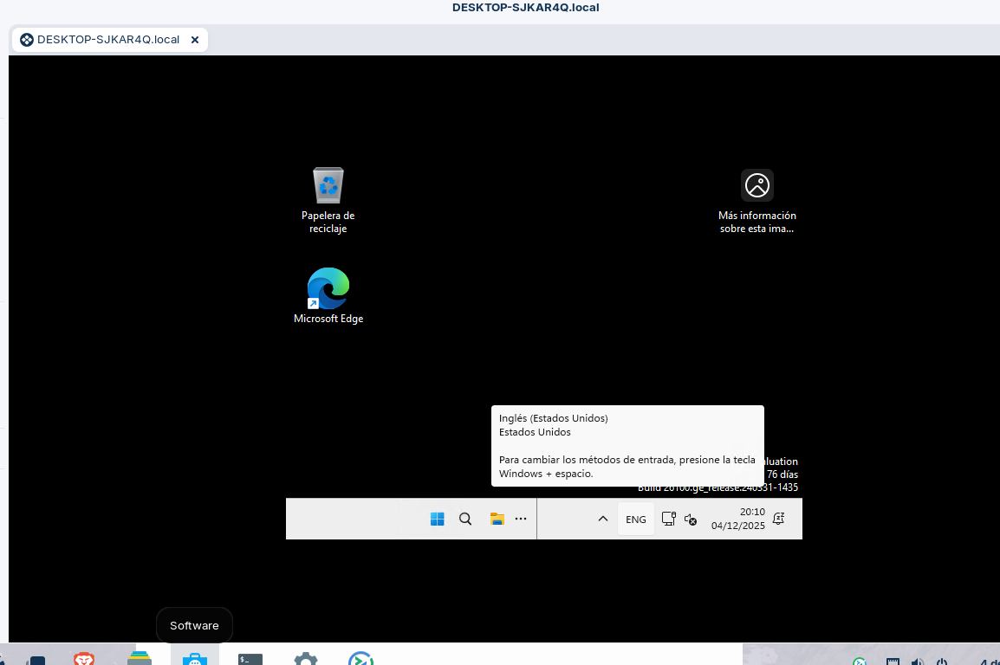

Ara activarem el control remot a Zorin, per fer-ho accedim a Configuració → Compartir → Activar "Compartir pantalla" seguidament activem"Control remot" → Definir contrasenya. 

Ara definim les dades d'accés segons sigui necessari.

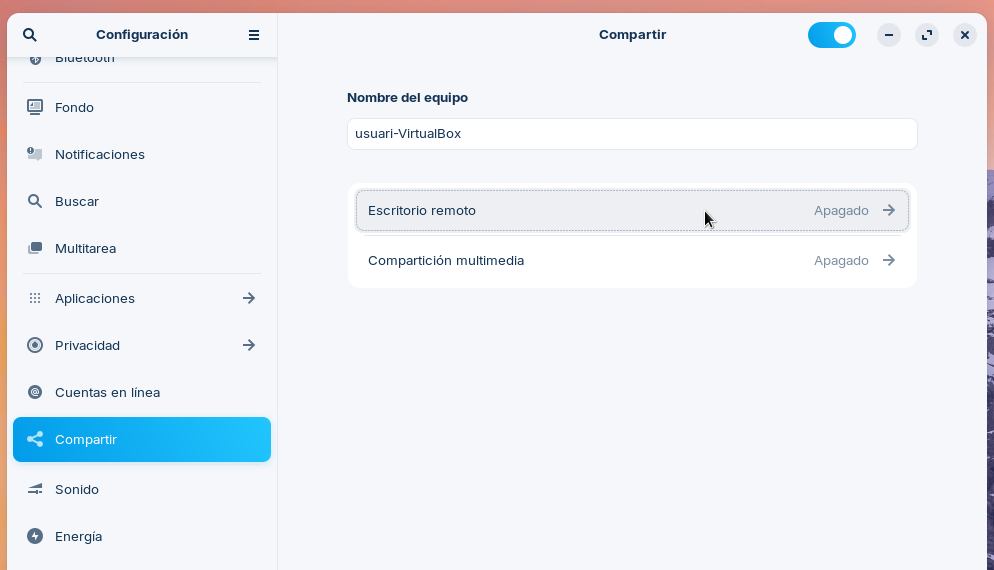

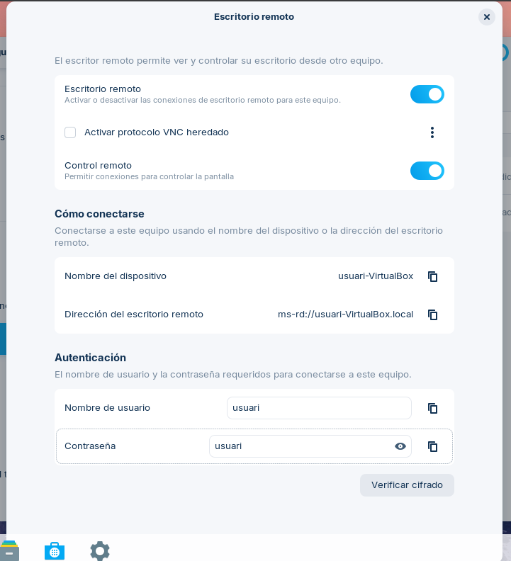

Des de Windows ara podem conectarnos a zorin, amb Escritorio Remoto. Obrirem l’aplicació i introduïrem les dades d’acces.

Equipo: usuari-VirtualBox.local com hem observat abans quan hem configurat l’escritorio remoto a zorin.
Usuario: usuari, ja que es el que hem definit a zorin.

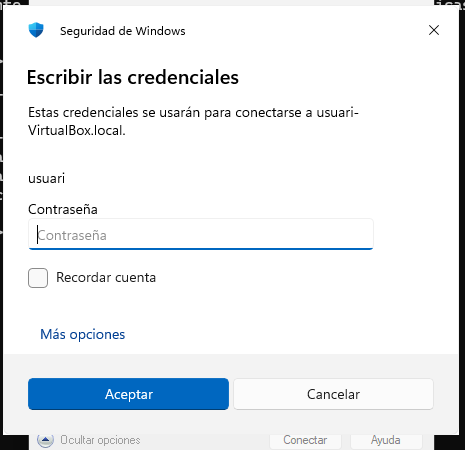

Introduïm la contrasenya que hem definit a la configuració a zorin.

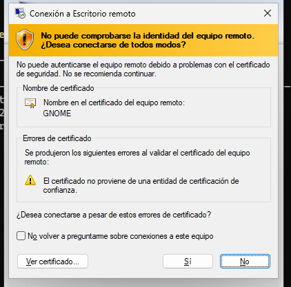

Acceptem i ja estariem dins!!

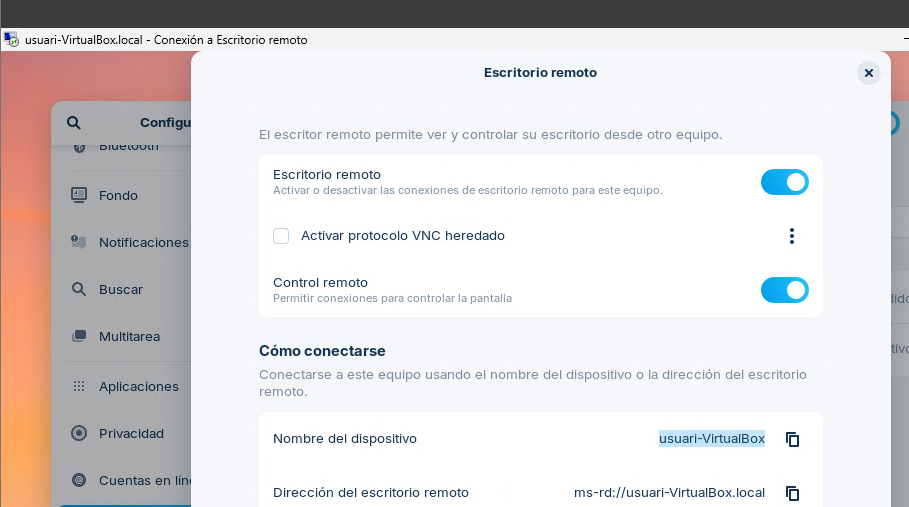

***

## ⚠️ Resolució de Problemes Ràpida (Quick Troubleshooting)
_Informació adicional cercada a Google, no especialment provada o usada per mí_

La velocitat en la connexió defineix la qualitat del nostre servei. Aquí hi ha els errors més habituals i la seva solució:

| Problema Comú | Causa Probable | Solució Ràpida per a EverPia |
| :--- | :--- | :--- |
| **"No es pot connectar al PC remot."** | El trànsit està bloquejat pel *Firewall* (Port TCP **3389**), o el servei RDP està inactiu. | 1. **Verificar el Firewall de Windows** i assegurar-se que l'excepció RDP està activada. 2. Assegurar-se que el servei "Escriptori Remot" estigui en marxa. |
| **"Error d'autenticació..." (NLA)** | Les credencials d'accés són incorrectes, o l'usuari no té permisos d'accés remot. | L'usuari que intenta connectar-se ha de ser administrador o formar part del grup **"Usuaris d'Escriptori Remot"** a la màquina servidor. |
| **Connexió a Zorin falla amb el nom d'equip** (`usuari.local`) | El servei de resolució de noms local (mDNS/Bonjour) no funciona correctament a la xarxa. | **Intentar connectar-se directament amb l'adreça IP** de la màquina Zorin en lloc del nom. |
