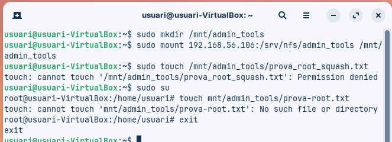
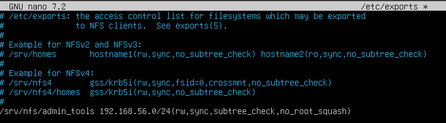
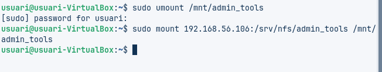
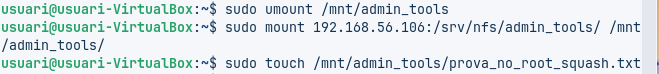
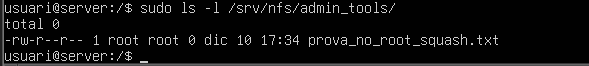
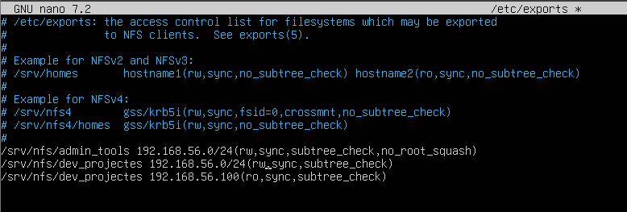

# NOM TASCA
## Fase 1: Preparació de l'entorn

Haurem de tenir dues màquines virtuals operatives, un ubuntu server i un client zorin. Les dues actualitzades i visibles entre elles, per tant els adaptadors en Xarxa NAT i Host-Only.
Per comprar-ho farem ping entre elles.

```bash
ip a
ping [ip client/server]
```


## Fase 2: Preparació del servidor
### Creació de Grups i Usuaris

En el servidor haurem de crear dos usuaris i dos grups, asignar cada usuari al seu grup corresponent.
- dev01 --> devs
- admin01 --> admins

```bash
sudo groupadd devs
sudo groupadd admins

sudo adduser dev01
sudo adduser admin01

sudo usermod -a -G devs dev01
sudo usermod -a -G admins admin01
```


Aquests usuaris i grups hauran de coincidir en el client, forçant també els uid i guid.

```bash
sudo groupadd -g [gid] admins
sudo groupadd -g [gid] devs

sudo useradd -m -u [uid] admin01
sudo useradd -m -u [uid] dev01

sudo usermod -a -G admins admin01
sudo usermod -a -G devs dev01

id dev01 admin01
```


### Creació de Directoris
Ara crearem dos directoris, un per a cada grup i asignarem els permisos correctes.

```bash
sudo mkdir -p /srv/nfs/dev_projects
sudo mkdir -p /srv/nfs/admin_tools
```


### Permisos del Servidor
L'usuari root haurà de ser propietari dels dos directoris, mentre que els grups hauran de tenir permisos totals.

/srv/nfs/dev_projects --> devs amb permisos totals
/srv/nfs/admin_tools --> admins amb permisos totals

```bash
sudo chown -R root:devs /srv/nfs/dev_projects
sudo chown -R root:admins /srv/nfs/admin_tools

sudo chmod -R 770 /srv/nfs/dev_projects
sudo chmod -R 770 /srv/nfs/admin_tools

ls -ld /srv/nfs/*
```


### instal·lació del servei nfs
Instal·larem el servei nfs en el servidor
```bash
sudo apt install nfs-kernel-server -y
```


### Fitxer exportació - Configuració Inicial

Afegirem aquestes líneas al final del arxiu.
```
/srv/nfs/dev_projects 192.168.56.0/24(rw,sync,subtree_check)
/srv/nfs/admin_tools 192.168.56.0/24(rw,sync,subtree_check)
```


```
sudo exportfs -a

sudo systemctl enable nfs-server
sudo systemctl start nfs-server
sudo systemctl status nfs-server
```


## Fase 3: L'Exportació d'Administració (El Dilema del root_squash)
### Prova 1 (L'error comú): Exportació amb root_squash (Opció per defecte)

Exportació configurada amb rw,sync (implica root_squash).
**Client - Muntatge i Prova d'Escriptura (com a root del Client):**
```bash

sudo mkdir /mnt/admin_tools
sudo mount 192.168.56.10:/srv/nfs/admin_tools /mnt/admin_tools
sudo touch /mnt/admin_tools/prova_root_squash.txt
```


Com a causa del root_squash no ens deixa crear l'arxiu ja que detecta que root es nobody i nobody no te permisos per crear arxius.

### Prova 2 (La Solució): Utilitzar no_root_squash
Modifiquem l'exportació per permetre que l'usuari root del client mantingui els seus privilegis al servidor.

**Servidor - Modificació de /etc/exports:**

```bash
/srv/nfs/admin_tools 192.168.56.0/24(rw,sync,subtree_check,no_root_squash)
```



**Aplicar els canvis**

```
sudo exportfs -a
```

**Client - Desmuntar i Tornar a Muntar:**

```bash
sudo umount /mnt/admin_tools
sudo mount 192.168.56.10:/srv/nfs/admin_tools /mnt/admin_tools
```


**Client - Intent d'escriptura com a root:**

```bash
sudo touch /mnt/admin_tools/prova_no_root_squash.txt
```


**Servidor comprovem la propietat**
```bash
ls -l /srv/nfs/admin_tools/
```



El fitxer `prova_no_root_squash.txt` al Servidor és propietat de `root:root`

## Fase 4: L'Exportació de Desenvolupament (Permisos rw vs ro)
Modificarem l'exportació de /srv/nfs/dev_projects per aplicar permisos diferents basats en la IP d'origen.

### Servidor - Modificació de /etc/exports (Afegir dues línies):

```bash
/srv/nfs/admin_tools 192.168.56.0/24(rw,sync,subtree_check,no_root_squash)
/srv/nfs/dev_projects 192.168.56.0/24(rw,sync,subtree_check)
```


Apliquem els canvis
```bash
sudo exportfs -a
```

### Prova 1: Escriptura amb client (Permisos rw)

Client - Muntatge i Prova d'Escriptura (com a usuari dev01):

```bash
sudo mkdir /mnt/dev_projects

sudo mount 192.168.56.10:/srv/nfs/dev_projects /mnt/dev_projects

su dev01

touch /mnt/dev_projects/dev01_escriptura_OK.txt

exit
```


### Prova 2: Escriptura amb client (Permisos ro)

**Servidor, modifiquem l'arxiu /etc/exports i el deixem aixi:**
```bash
/srv/nfs/admin_tools 192.168.56.0/24(rw,sync,subtree_check,no_root_squash)
/srv/nfs/dev_projects 192.168.56.0/24(rw,sync,subtree_check)
```


Apliquem els canvis
```bash
sudo exportfs -a
```

**Client** 

```bash
sudo umount /mnt/dev_projects
sudo mount 192.168.56.10:/srv/nfs/dev_projects /mnt/dev_projects

su dev01

touch /mnt/dev_projects/dev01_escriptura_FAIL.txt

exit
```


## Fase 5: Muntatge Automàtic amb /etc/fstab

Configurarem el client per muntar els recursos automàticament a l'inici.

**Client - Edició de /etc/fstab:**

Afegir les dues línies següents:
```bash
192.168.56.10:/srv/nfs/dev_projects /mnt/dev_projects nfs defaults,timeo=900,retrans=5,_netdev 0 0
192.168.56.10:/srv/nfs/admin_tools  /mnt/admin_tools  nfs defaults,timeo=900,retrans=5,_netdev 0 0
```


> Opció _netdev: Indica al sistema que el muntatge s'ha de fer només després que la xarxa estigui operativa. Essencial per a NFS.

**Client - Prova de les entrades:**
```bash
sudo mount -a
mount | grep nfs
```


Ara reiniciem la màquina client i revisem que els directoris s'han muntat automàticament.

```bash
ls -l /mnt/dev_projects
ls -l /mnt/admin_tools
```

