# T09: Servidor fitxers Linux. NFS (tasca individual)
## Fase 1: Configuració del entorn
Haurem de tenir dues VM un **Client** i un **Servidor**, hauran de tenir dos adaptadors de xarxa. Un en xarxa nat i l'altre en host-only.

Actualitzarem les dues màquines
```bash
sudo apt update -y && sudo apt upgrade -y
```

Comprobarem que les dues màquines es veuen entre si amb un ping.
```bash
ping IP_CLIENT
```
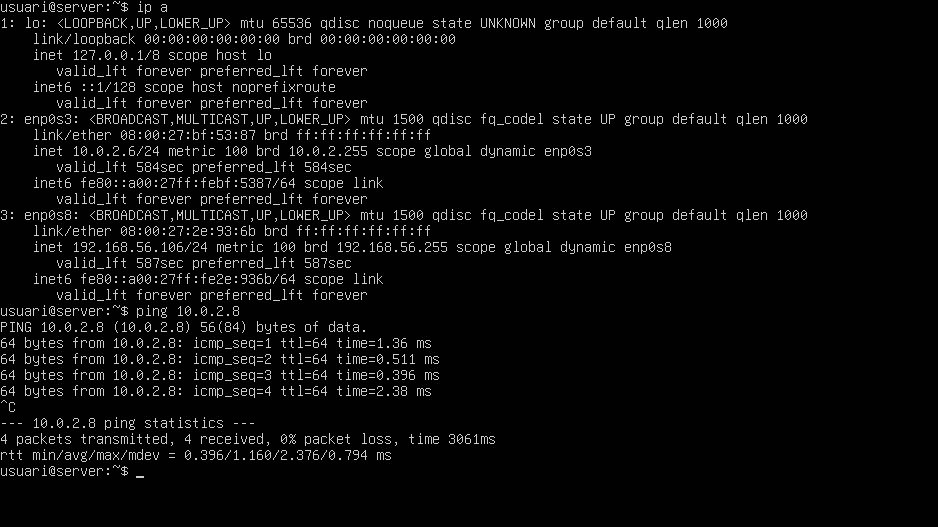

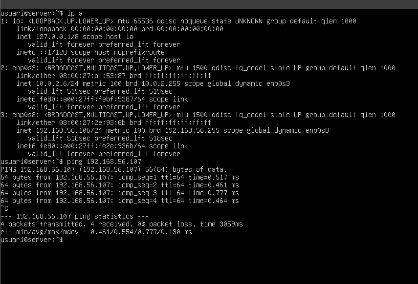

```bash
ping IP_SERVIDOR
```
Des del **Servidor** crearem dos grups **devs** i **admins**.
```bash
sudo groupadd devs
```
```bash
sudo groupadd admins
```
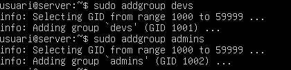

Crearem dos usuaris
- dev01 membre de devs
- admin01 membre de admins

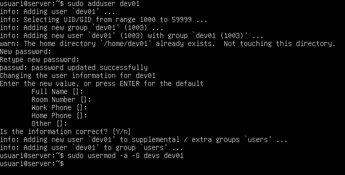

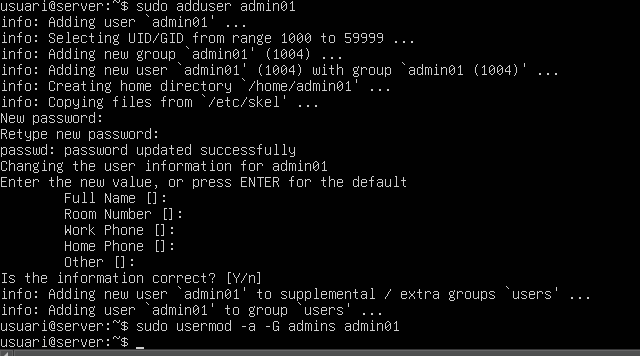

Crearem els directoris admin_tools i dev_projectes

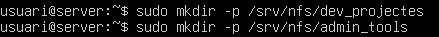

El grup Devs tindra control total sobre els seus projectes
El grup Admins tindra control total sobre les seves eines
l'usuari propietari de tots dos casos serà root.

Per definir aquests permisos introduïrem aquestes comandes.

```bash
sudo chown root:devs /srv/nfs/dev_projectes/
```
```bash
sudo chown root:admins /srv/nfs/admin_tools/
```
```bash
sudo chmod 770 /srv/nfs/dev_projectes/
```
```bash
sudo chmod 770 /srv/nfs/admin_tools/
```
Usarem aquesta comanda per comprobar els permisos

```bash
ls -la /srv/nfs/
```

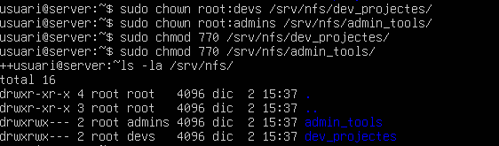

Seguidament instal·larem el servei NFS
```bash
sudo apt install nfs-kernel-server
```


I l'habilitarem i iniciarem

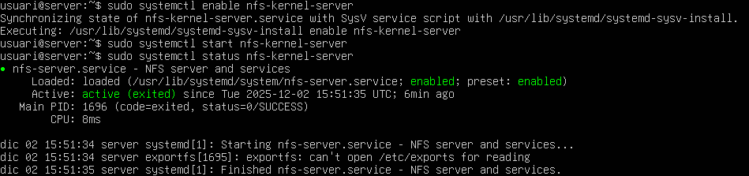

Ara al **Client** haurem de configurar amb les mateixes gid i uid els usuaris i grups. Per fer-ho ens apuntem aquests ids del nostre servidor.

SERVIDOR
```bash
id admin01 && id dev01
```
**Apuntem/Guardem** el uid del usuaru i el guid de cada grup (admins, devs).
CLIENT:
Ara recplicarem aquests, per fer-ho usem aquestes comandes.

```
sudo groupadd -g 1002 admins
sudo groupadd -g 1001 devs
sudo adduser --uid 1004 admin01
sudo useradd --uid 1003 dev01
sudo usermod -a -G admins admin01
sudo usermod -a -G devs dev01
```
I per verificar
```bash
id dev01 && admin01
```
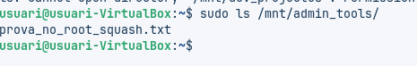

Instal·lem el servei nfs necessàri
```bash
sudo apt install nfs-common -y
```
Al servidor, modificarem l'arxiu /etc/exports per permetre exportar el nostre directori
```bash
sudo nano /etc/exports
```
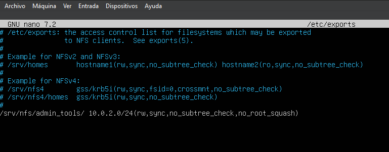

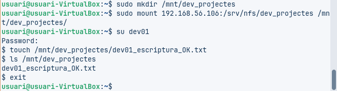

Des del client podem verificar que esta exportant el servidor.

```bash
sudo showmount -e 10.0.2.6
```
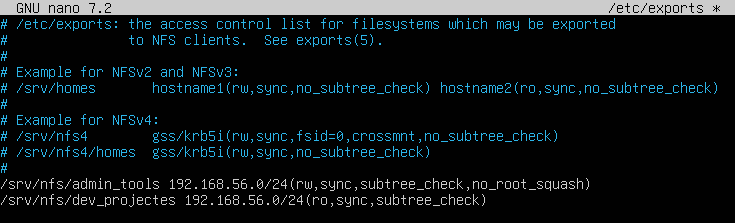

I podem muntar el directori del servidor a un dels directoris del client.

```bash
sudo mount -t nfs 10.0.2.6:/srv/nfs/admin_tools /mnt/admin_tools/
```
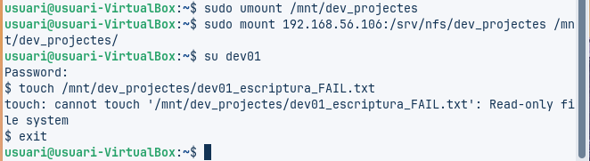

Comprobem com els arxiu estan disponibles en el directori on hem muntat els arxius, podem fer-ho amb comandes (ls) o des del gui.

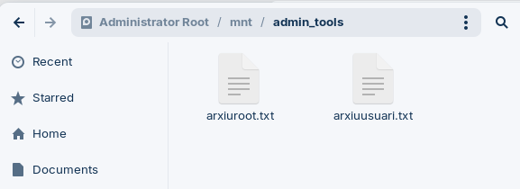

Ara configurem el client per a que es monti automàticament la nostra carpeta al iniciar sessió. Això ho farem editant l'arxiu /etc/fstab
```bash
sudo nano /etc/fstab
```
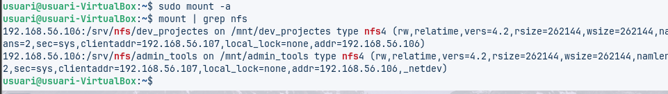

Ara ja tindriem un sistema complert on els fitxers del servidor son compartits amb el client respectant els permisos de cada grup per a les carpetes.

Ara com a pas final caldrà fer el mateix per a el directori de devs (muntar-lo i configurar)

Des del servidor afegim una nova línea a l'arxiu /etc/exports per configurar el directori.

```bash
sudo nano /etc/exports
```
Afegim aquesta línea despues de la de admin_tools.
```bash
/srv/nfs/dev_projectes/ 10.0.2.0/24(rw,sync,no_subtree_check,no_root_squash)
```
> **IMPORTANT:** En aquest pas és important copiar tot correctament, ja que per exemple si posem ro en comptes de rw nomes tindrem persmisos per llegir (read only). Com es pot observar a la següent imatge.

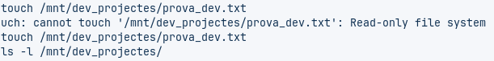

Des del client haurem de crear el directori per muntar-ho en aquest.

```bash
sudo mkdir -p /mnt/dev_projectes
sudo mount 10.0.2.6:/srv/nfs/dev_projectes /mnt/dev_projectes
```
Iniciem sessió com dev01 i probem de crear un fitxer dins ell.

```
su - dev01
(Contrasenya)
touch /mnt/dev_projectes/prova_dev.txt
ls -l /mnt/dev_projectes/
```
Podrem observar com l'arxiu ha sigut crear correctament.

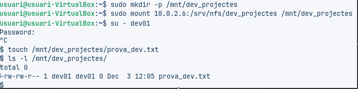


