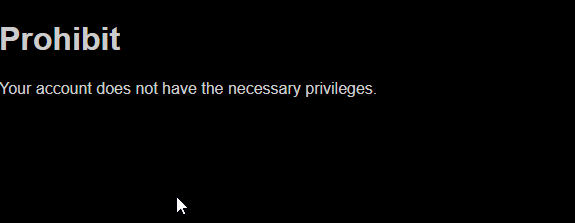
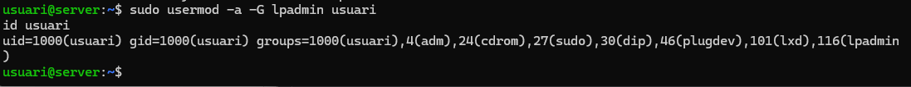
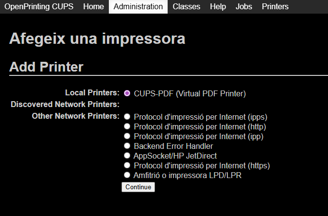
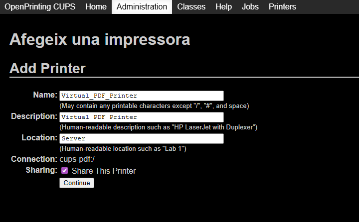
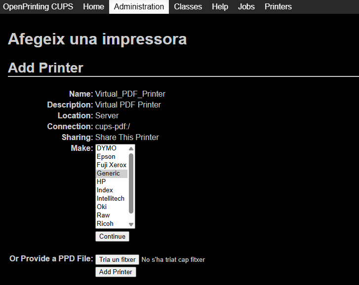
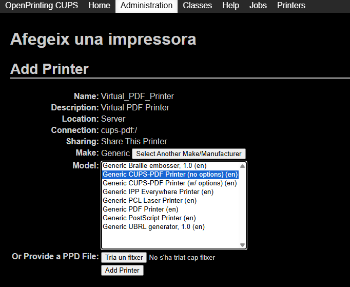
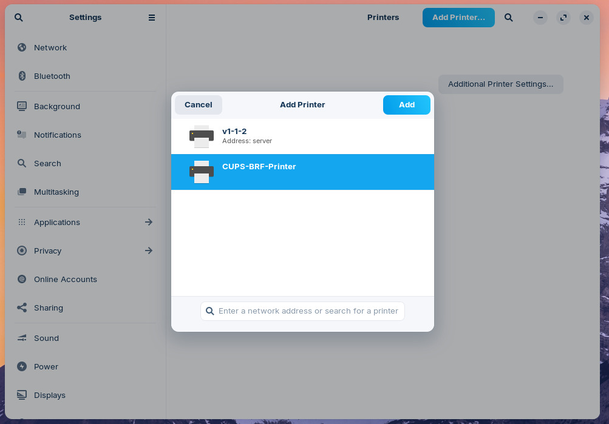
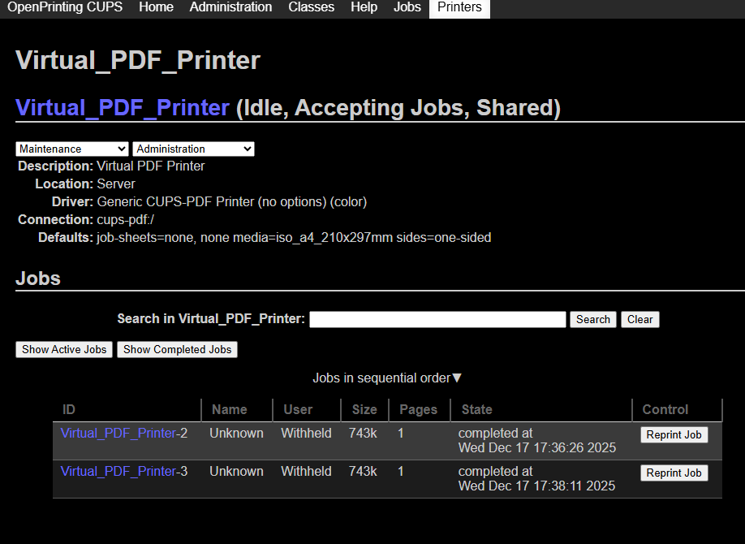
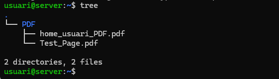

# T10: Servidor impressió Linux. CUPS (tasca individual)

En aquesta practica haurem de tenir dues VM, Ubuntu Server, Zorin Client, les dues amb una segona interfície Host-only. Per començar es dues màguines hauram d'estar actualitzades.
```bash
sudo apt update -y
sudo apt upgrade -y
```
Ara haurem de instal·lar els paquets necessàris per tenir una impressora virtual.

```bash
sudo apt install cups-pdf
```


Per accedir a la configuració haurem d'iniciar sessió web des d'un client i accedir per el port 631, pero si ho fem donarà error de conexió, per solucionar-ho cal editar l'arxiu `/etc/cups/cupsd.conf`, però com sempre primer farem un còpia de seguretat de l'arxiu.
```bash
sudo cp /etc/cups/cupsd.conf /etc/cups/cupsd_copy.cong
sudo nano /etc/cups/cupsd.conf
```


Ara reiniciem el servei i comprovem el seu correcta funcionament.
```bash
sudo systemctl restart cups
sudo systemctl status cups
```


Ara si que podrem accedir i iniciar sessió des d'un client a la web.

https://IP:631

El següent pas sera afegir una impressora virtual, per fer-ho anem a la pestanya **Administració**

Si ens demana iniciar sessió introduïm les credencials del nostre usuari.


Seguidament fem clic a **Add printer**


Ens aparèixera un error de no tenir **permisos**, per solucionar-ho hem d'afegir el nostre usuari al grup **lpadmin**.



```bash
sudo usermod -a -G lpadmin usuari
id usuari
```



Ara ja podrem afegir una impressora, fem clic a **Add printer** i seleccionem la configuració de l'impressora.

Local Printers: CUPS-PDF (Virtual PDF Printer)



Nombre: (El podem cambiar si desitjem)
Descripción: (La podem cambiar si desitjem)
Ubicación: Server
Compartición: Activada  <-- **IMPORTANT**



Marca/Make: Generic
Model: Generic CUPS-PDF Printer (no options) (en)
Fem click a **Add printer**

 

Ara afegirem l'impressora recent creada al client, anirem a **Settings** --> **Printers** --> **Add printer**

Seleccionem i afegim la nostre impressora



Ara enviem diversos treballs d'impressió des del client i observem com apareixen a la cua.



També podem veure al servidors els documents PDF que s'han generat amb les peticions.
```bash
tree
```



