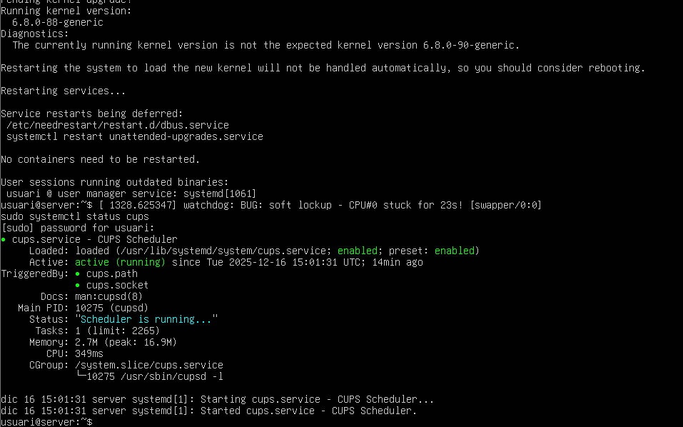
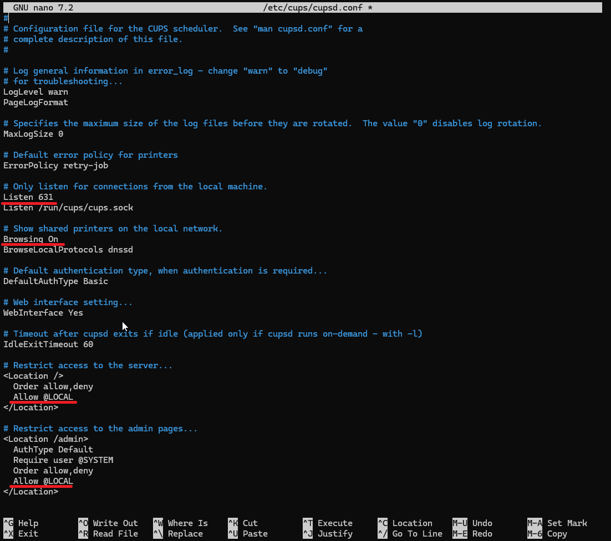
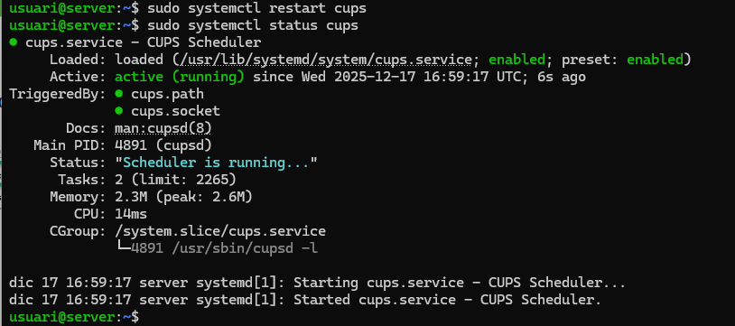
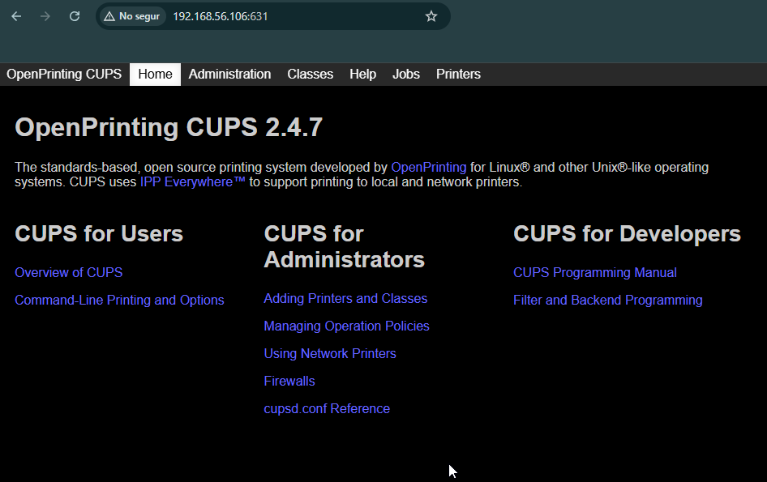
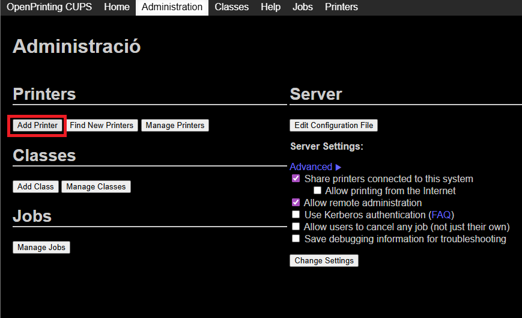

# titulo

En aquesta practica haurem de tenir dues VM, Ubuntu Server, Zorin Client, les dues amb una segona interfície Host-only. Per començar es dues màguines hauram d'estar actualitzades.
```bash
sudo apt update -y
sudo apt upgrade -y
```
Ara haurem de instal·lar els paquets necessàris per tenir una impressora virtual.

```bash
sudo apt install cups-pdf
```


Per accedir a la configuració haurem d'iniciar sessió web des d'un client i accedir per el port 631, pero si ho fem donarà error de conexió, per solucionar-ho cal editar l'arxiu `/etc/cups/cupsd.conf`, però com sempre primer farem un còpia de seguretat de l'arxiu.
```bash
sudo cp /etc/cups/cupsd.conf /etc/cups/cupsd_copy.cong
sudo nano /etc/cups/cupsd.conf
```


Ara reiniciem el servei i comprovem el seu correcta funcionament.
```bash
sudo systemctl restart cups
sudo systemctl status cups
```


Ara si que podrem accedir i iniciar sessió des d'un client a la web.

https://IP:631

El següent pas sera afegir una impressora virtual, per fer-ho anem a la pestanya **Administració**

Si ens demana iniciar sessió introduïm les credencials del nostre usuari.



Seguidament fem clic a **Add printer**


